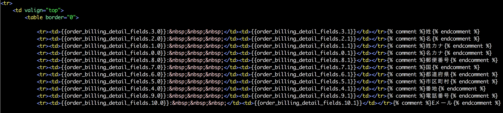
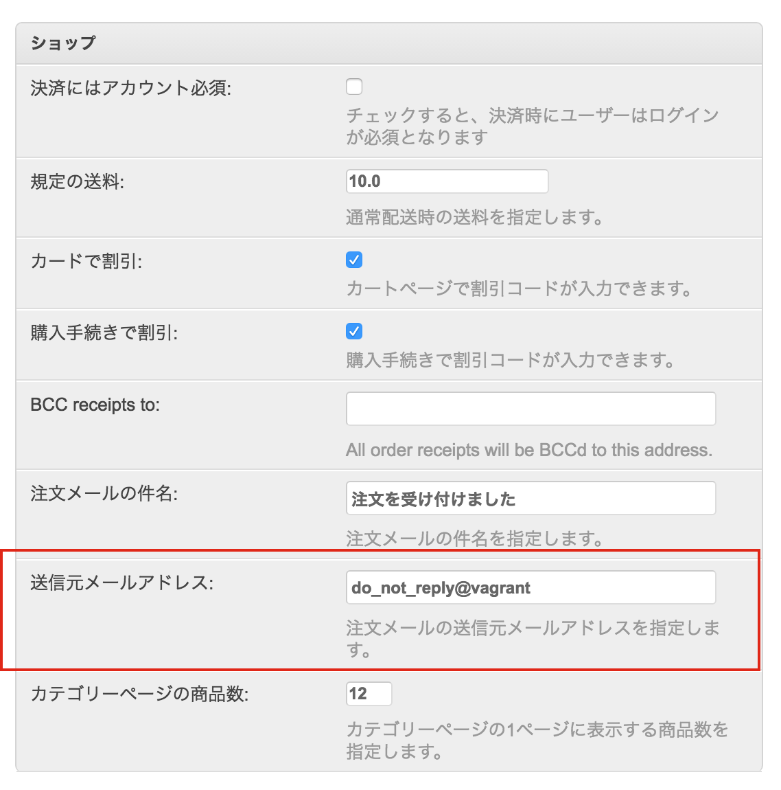
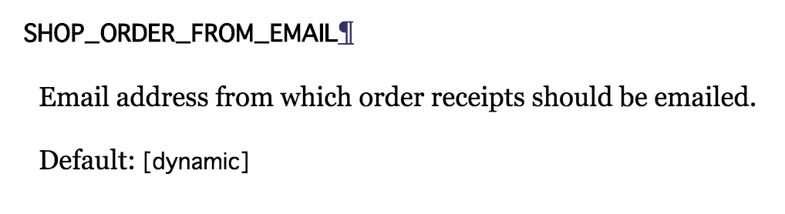
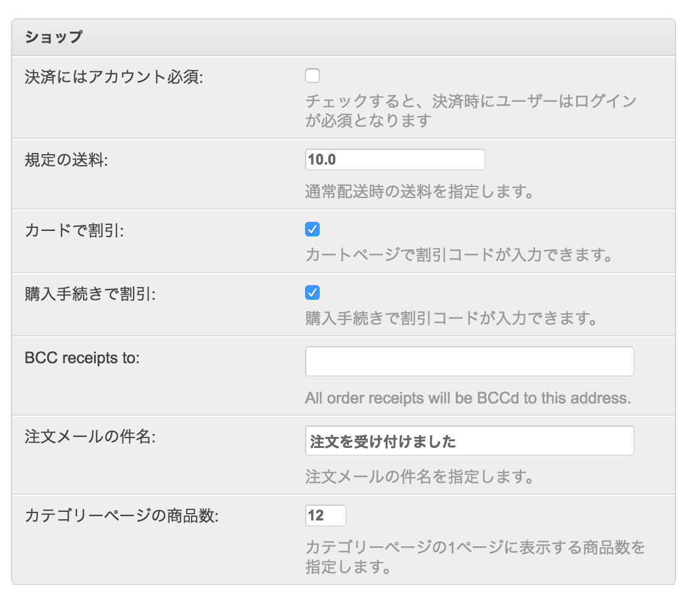

==============================================================
Mezzanine(Cartridge)で上げよう　コードリーディング力
==============================================================

Mitsuki Sugiya  (@equal_001)

PyLadies Tokyo - 二周年記念パーティ

2016/10/22 SAT

お前誰よ
==========

.. image:: ./img/me.jpg
   :width: 150

- 杉谷 弥月  (@equal_001)
- コテハンはOMEGAです
- ビープラウドという会社でPythonでWebアプリ開発のお仕事をしてます
- PyCon JP 2016でPythonista（iOSアプリ開発環境ツール）について発表しました

今日話す内容
===============

- MezzanineとCartridgeの紹介
- これら2つを使ってコードリーディング力を上げていくゾッ

Mezzanineとは？
==================================

Mezzanineとは？
==================================

- Python製のCMS
- PHPでいうWordpressみたいなもの
- Djangoの上に乗っかっている
- pip install mezzanine

.. image:: /img/mezzanine.png
   :width: 700

Mezzanineとは？
==================================

.. image:: /img/mezzanine2.png
   :width: 700

Mezzanineとは？
==================================

.. image:: /img/mezzanine3.png
   :width: 800

cartridgeとは？
==================================

cartridgeとは？
==================================

- MezzanineにCart機能をつけることができるプラグイン
- Djangoの上に乗っかっているMezzanine、の上に乗っかっている
- pip install cartridge

.. image:: /img/cartridge.png
   :width: 700

cartridgeとは？
==================================

.. image:: /img/cartridge2.png
   :width: 700

cartridgeとは？
==================================

.. image:: /img/cartridge3.png
   :width: 700

仕事で使う
==================================

- CMS(Mezzanine/Cartridge) に手を入れずに拡張したい

 - バージョンアップするときにできるだけバグが起きないようにするため

- 独自アプリを切って必要な部分だけオーバーライドする
- それでも要件を満たせない機能は独自アプリを追加し、実装する

鍛えられ話その1
============================

鍛えられ話その1
============================

「注文情報を入力するフォームの順番を変更したい」

鍛えられ話その1
============================

「注文情報を入力するフォームの順番を変更したい」

- デフォルトでは 名-姓-市区町村-都道府県-国・・・アメリカ式の順序
- 注文フォームはCartridgeのOrderFormで実装されている
- まずTemplateを見てみるとフォームは自動生成されている

::

  <fieldset>
      <legend></legend>
      
  </fieldset>

- form.pyを確認するとOrderモデルのフォームをfieldsに指定している

::

   class Meta:
       model = Order
       fields = ([f.name for f in Order._meta.fields if
                  f.name.startswith("billing_detail") or
                  f.name.startswith("shipping_detail")] +
                  ["additional_instructions", "discount_code"])

-> my_shopを作成し、OrderFromを継承したFromでfieldsを上書きすれば良い

鍛えられ話その1
============================

「注文確認メールで表示される住所の順番を変更したい」

- フォームの順序変更と同じ感じでいけるやろ！

鍛えられ話その1
============================

「注文確認メールで表示される住所の順番を変更したい」

- templateからメール送信している場所を特定する

::

  def send_order_email(request, order):
      """
      Send order receipt email on successful order.
      """
      settings.use_editable()
      order_context = {"order": order, "request": request,
                       "order_items": order.items.all()}
      order_context.update(order.details_as_dict())

- orderオブジェクトのattribule、つまりOrderモデルのclassmethodでフィールドを取得している...？

鍛えられ話その1
============================

::

   def details_as_dict(self):
       """
       Returns the billing_detail_* and shipping_detail_* fields
       as two name/value pairs of fields in a dict for each type.
       Used in template contexts for rendering each type as groups
       of names/values.
       """
       context = {}
       for fieldset in ("billing_detail", "shipping_detail"):
           fields = [(f.verbose_name, getattr(self, f.name)) for f in
               self._meta.fields if f.name.startswith(fieldset)]
           context["order_%s_fields" % fieldset] = fields
       return context

鍛えられ話その1
============================

ダメです

鍛えられ話その1
============================

- CMS(Mezzanine/Cartridge) に手を入れずに拡張したい
- この制約があるのでCartridgeのOrderモデルに手を入れることができない
- Fromの上書きでも対応できない
- templateで対応することになる

似たようなことをしないといけないのがあと3箇所ある

つらい

鍛えられ話その2
============================

「管理画面のSiteのSettingsにあるShop用メールアドレスを意図したものにしたいので調査して」

「環境変数とかでメールアドレスを指定できたら最高だよね」

- Settingsというくらいだからsettings.pyで定義できるやろ！

鍛えられ話その2
============================

- CartridgeのSettingsのドキュメントをみる
- それっぽいものがあった

- [dynamic] ってなんや..でもリストでなんか渡すっぽい？
- ヨシャ、settings.pyに書いてみるか

::

  SHOP_ORDER_FROM_EMAIL = ["hogehoge@test.jp"]

鍛えられ話その2
============================

メールフォームが消えた

鍛えられ話その2
============================

ダメです

鍛えられ話その2
============================

- [dynamic] ってなんだよ -> ドキュメントに乗ってない -> DjangoもMezzanineもそれっぽいものがない
- コード読むしかない

鍛えられ話その2
============================

- cartridge/shop/defaults.py でShopで使用するsettingsを定義しているようだ

::

  register_setting(
      name="SHOP_ORDER_FROM_EMAIL",
      label=_("From Email"),
      description=_("Email address from which order receipts should be "
          "emailed."),
      editable=True,
      default="do_not_reply@%s" % gethostname(),
  )

- 最終的にMezzanineのSettingsの設定方法のドキュメントへたどり着く
- アプリ配下にdefaults.pyを生成し、そこに設定を書いていくと、Mezzanine側が勝手に読み込んで管理画面のSettingsを生成してくれる
- mezzanine/conf/__init__.py の register_settingメソッドでsettingsを生成していた
- my_shopアプリのdefaults.pyでSHOP_ORDER_FROM_EMAILを上書きすれば良い
- けど、面倒臭い。settingsとはなんだったのか。
- ていうか [dynamic] ってなんだよ

鍛えられ話その2
============================

- Mezzanine/Cartridgeのドキュメントは簡易すぎる（3rd-party製ではよくあること
- どうあがいてもコード読まなければいけない

結果
=========

- ドキュメントに書かれていない->フレームワークやモジュールのコードを読むの姿勢が自然と身についた
- OrderFormの実装みたいに拡張性のないコードを、どう改善できるかを考える機会にもなる
- Djangoはすごい。フックポイントがあんなにあるなんて...

まとめ
==========

- MezzanineやCartridgeを使い込んだらコードリーディング力がUPするのでおすすめ！
- 程よく整頓されてないコードは学びがある（当人比
- ブログやショップ機能はモデル構成や設計がわかりやすい題材
- フレームワークやCMSはPythonの特殊メソッドやメタプロを勉強するにはもってこい

